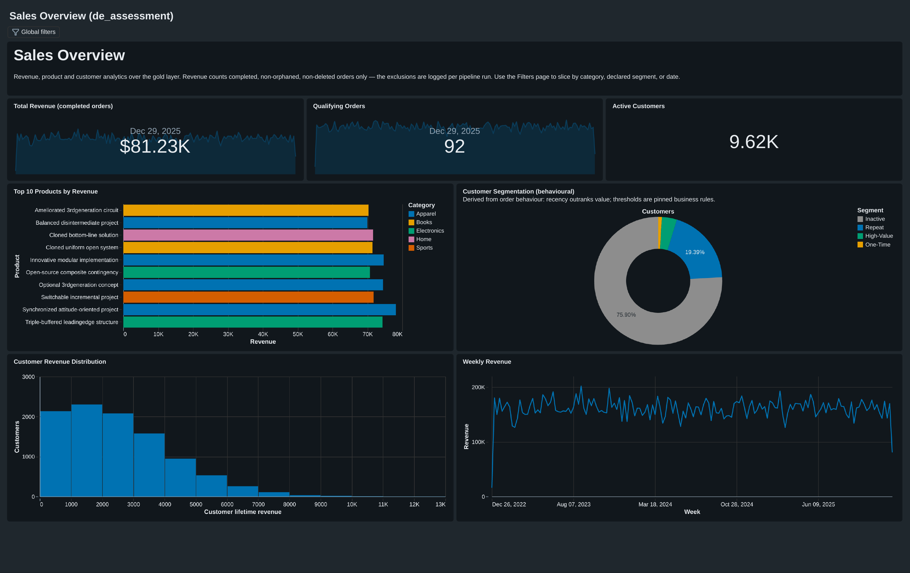

# Sales Overview Dashboard — Guide

One AI/BI dashboard over the four gold tables. The committed
[`sales_overview.lvdash.json`](sales_overview.lvdash.json) is the executed
source of truth; [`dashboard_queries.sql`](dashboard_queries.sql) is a
generated, guard-tested export of its dataset queries.

## Preview



## Tiles

| Tile | Type | Reads | What it answers |
|---|---|---|---|
| Total Revenue | KPI + weekly sparkline, compact USD | `daily_weekly_trends` | how much, and rising or falling |
| Qualifying Orders | KPI + weekly sparkline | `daily_weekly_trends` | volume, and its trend |
| Active Customers | KPI | `revenue_by_customer` | how many customers ever bought |
| Top 10 Products by Revenue | horizontal bar, colored by category | `sales_by_product` | which products lead, and which categories dominate the top |
| Customer Segmentation | pie (behavioural segments, semantic colors) | `customer_segmentation` | the mix of High-Value / Repeat / One-Time / Inactive |
| Customer Revenue Distribution | histogram, 1,000-unit bins | `revenue_by_customer` | how customer value is distributed (including the zero bucket) |
| Weekly Revenue | line | `daily_weekly_trends` | the trend, at week grain |

Every number inherits the gold layer's stated business rule: completed,
non-orphaned, non-deleted orders only.

## Filters (Filters page — global)

A filter affects only the datasets that carry its field:

| Filter | Field | Affects |
|---|---|---|
| Date range | `order_date` | trend line + both sparkline KPIs |
| Product category | `category` | the top-10 bar (within the precomputed top 10 — see below) |
| Declared segment | `customer_segment` | Active Customers KPI + revenue histogram |

Known scoping choices, on purpose:
- **Category filters within the top 10** — the dataset pre-limits to the
  overall top 10, so picking a category narrows those ten rather than
  recomputing a per-category top 10 (which would need the limit moved out
  of the dataset). Titled accordingly.
- **No country filter** — gold deliberately does not carry `country`;
  adding it would widen `revenue_by_customer`'s contract for one filter.
- The pie keeps its own derived-segment vocabulary and is intentionally
  not driven by the declared-segment filter (different taxonomies).

## Deploy / update / publish

```bash
bash scripts/deploy-dashboard-ce.sh            # de_assessment (default)
```

Idempotent: upserts by display name (URL stays stable), regenerates
`dashboard_queries.sql`, publishes with embedded credentials. The committed
JSON keeps bare table names for portability; the script renders
`<catalog>.gold.` onto each `FROM` at upload time (this CLI version predates
the `--dataset-catalog/--dataset-schema` flags that would do it natively).

Published URL: `https://dbc-06f970f4-0f19.cloud.databricks.com/dashboardsv3/01f1a2acedca1f80bbbad49674ed438a/published?o=1674584039228950`.
Community Edition is single-user — that URL only resolves for the author's
own login, so it's not a way to share the dashboard with anyone else. The
[preview](#preview) above and the committed spec/queries are what a reader
without CE access verifies against.

## Refresh and performance

- **No refresh schedule** — published with embedded credentials, every view
  queries the live gold tables, so freshness is inherited from the pipeline
  (gold recomputes within ~2 minutes of any silver commit via its
  table-update trigger). A schedule would only re-read unchanged tables.
- **Nothing to index** — Delta has no B-tree indexes; the equivalents are
  data skipping and clustering, and they pay off by reducing *files
  scanned*. The gold tables are 502 / 10,010 / 1,096 / 4 rows — essentially
  one file each — so every tile is a single-file scan and any clustering
  would be overhead. This is a designed outcome: the recompute-into-small-
  gold-tables decision is the dashboard's performance strategy. At real
  scale the levers are clustering `daily_weekly_trends` by `order_date`
  and the silver scan side, both documented in the gold design.
- First view after idle cold-starts the serverless warehouse (seconds).

## Structural guards

`databricks/jobs/gold/tests/test_dashboard_spec.py` (unit tier) guards the
spec's known footguns: 12-column rows, encoding↔query field matching,
dataset references, queryLines separators, bare table names, page metadata,
and drift between the JSON and the generated queries file.
