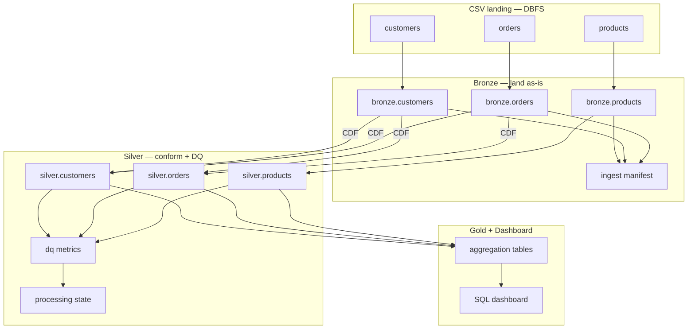
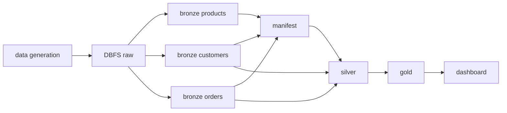

# High-Level Architecture — DE Medallion Pipeline

**Status:** Draft — pending review  
**Date:** 2026-08-20  
**Purpose:** Anchor document for layer-by-layer implementation in separate chats. Defines *what* and *why*; each layer chat hardens *how*.

**Environment:** Databricks Community Edition, profile `de-assessment-ce`, Asset Bundle under `databricks/bundle/`

---

## How to use this document

| Implementation chat | Hardens |
|---------------------|---------|
| Bronze | Autoloader jobs, Delta tables, manifest, CDF enablement |
| Silver | CDF consumption, merge semantics, DQ flags, processing state |
| Gold | Aggregations from Silver |
| Dashboard | SQL visualizations |

Do not treat this doc as a line-by-line implementation spec. Details (exact column lists, hash algorithms, bundle task keys) belong in the layer plans.

---

## 1. Problem statement

An e-commerce company lands CSV extracts (customers, orders, products) on DBFS. The pipeline must:

1. **Bronze** — ingest raw data into Delta without business cleaning  
2. **Silver** — conform, validate, flag bad rows (do not delete)  
3. **Gold** — business aggregations for analytics  
4. **Dashboard** — BI views for stakeholders  

~700 intentional data quality issues in sample data must surface in **Silver**, not be removed upstream.

---

## 2. Architectural principles

1. **Strict medallion boundaries** — Bronze lands; Silver conforms; Gold aggregates  
2. **Bronze never deletes or DQ-filters** — raw history preserved  
3. **Silver owns I/U/D semantics and DQ** — including soft deletes for dimensions  
4. **Incremental by design** — Silver consumes Bronze CDF deltas, not full Bronze rescans  
5. **Production patterns, CE pragmatism** — Autoloader batch (`availableNow`) per run, not 24/7 streaming  
6. **Observable ingests** — manifest and processing state for audit and catch-up  

---

## 3. Data model

| Table | Role | Primary key | Relationships |
|-------|------|-------------|---------------|
| `customers` | Dimension | `customer_id` | Referenced by orders |
| `products` | Dimension | `product_id` | Referenced by orders |
| `orders` | **Fact** | `order_id` | FK → customers, products |

Column definitions: `data-model.md`, `database/schema.sql`.

Gold joins **orders** to dimensions for sales-by-product, revenue-by-customer, and customer segmentation.

---

## 4. System context



---

## 5. Storage and landing (conceptual)

```
dbfs:/Volumes/de_assessment/raw/
├── products/          # scheduled weekly drops
├── customers/         # scheduled daily drops
└── orders/
    ├── incoming/      # event-driven batches
    └── processed/     # optional archive after ingest

dbfs:/Volumes/de_assessment/checkpoints/   # Autoloader checkpoints per table
```

Data generation job writes CSVs into this layout. Exact naming conventions are defined in the Bronze implementation chat.

---

## 6. Bronze layer (foundation)

### 6.1 Responsibility

Land source CSVs into **three separate Delta tables**. Add ingest metadata only. Enable CDF where incremental downstream consumption adds value.

### 6.2 Source delivery patterns

| Source | Delivery pattern | Trigger | Bronze write | CDF |
|--------|------------------|---------|--------------|-----|
| **products** | Full snapshot | Scheduled weekly | Append whole file | On |
| **customers** | Full snapshot | Scheduled daily | Append whole file | On |
| **orders** | Incremental file | File arrival | Append whole file | On |

Bronze is append-only for every source. Auto Loader checkpoints provide
file-level replay protection. Duplicate business keys and complete snapshot
history are retained for Silver.

### 6.3 Ingest engine

- **Autoloader** with per-table **checkpoint**  
- **`availableNow`** / trigger-once per job run (CE-friendly)  
- Typed schema from assessment spec + **`_rescued_data`** for parse failures  
- Metadata on all rows: ingest timestamp, source file, batch id, delivery pattern, row hash (required for full snapshots)  

### 6.4 Bronze rules

| Do | Do not |
|----|--------|
| Land source values as read | Apply I/U/D stamps |
| Log ingest runs to manifest | Delete rows |
| Enable CDF on all three entity tables | Run DQ checks or quarantine |
| Pass Delta version bounds to Silver | Enforce referential integrity |

### 6.5 Jobs

| Job | Trigger |
|-----|---------|
| Bronze products ingest | Weekly schedule |
| Bronze customers ingest | Daily schedule |
| Bronze orders ingest | File arrival (poll fallback on CE if needed) |
| `ingest_all.py` | Manual smoke only |

Split the current monolithic bronze bundle job into three triggered jobs plus a manual orchestrator.

---

## 7. Silver layer (contract from Bronze)

Silver is hardened in its own chat. Architecture contract:

### 7.1 Consumption model

- CSV has no CDF; **Bronze Delta** does  
- Silver reads **`table_changes`** for the unconsumed version range since last successful run  
- Catch-up: if Silver was skipped, next run processes all pending CDF in one batch  
- **No full Bronze table scan** — merge only rows from the current CDF window  

### 7.2 State

Minimal cursor per table (`silver.processing_state`): last consumed Bronze Delta version. Optional coordination via `bronze.ingest_manifest` version fields.

### 7.3 Conformance semantics

| Source | CDF-driven I/U | Soft delete (D) |
|--------|----------------|-----------------|
| **orders** | Deduplicate inserted incremental rows; compare with current Silver state | No |
| **customers** | Identify latest snapshot by batch; hash compare by PK | Yes — PK missing from latest snapshot |
| **products** | Identify latest snapshot by batch; hash compare by PK | Optional |

### 7.4 Assessment DQ (Silver)

Flag bad rows with `quality_check_result`; do not delete. Four check categories: completeness, uniqueness, referential integrity, type/business logic. Publish pass/fail metrics per run.

Bronze never performs these checks.

---

## 8. Gold layer and dashboard

**Gold** reads **Silver** only. Produces:

- `sales_by_product`  
- `revenue_by_customer`  
- `customer_segmentation`  

Uses active Silver rows (exclude soft-deleted dimensions). Dashboard: 3+ SQL visualizations per assessment spec.

Details hardened in Gold and Dashboard chats.

---

## 9. Job orchestration



**Dependencies:** dimensions can load independently of orders; orphan FKs (~80 rows) are intentional and flagged in Silver. Gold runs after Silver.

---

## 10. Non-goals (assessment scope)

- Enterprise config/quarantine frameworks (shadow/enforce modes, invalid tables)  
- Bronze-level I/U/D or deletes  
- Always-on streaming clusters on CE  
- S3 external volumes (use DBFS on CE; note S3 as production evolution)  
- Bronze-level business-key merges or deduplication  

---

## 11. Assessment alignment

| Requirement | Architecture answer |
|-------------|---------------------|
| Bronze raw ingest | §6 — land only, three tables |
| Data types at ingest | Typed schema + rescued data column |
| Ingest logging | Manifest + row metadata |
| Silver DQ flag-not-delete | §7.4 |
| Three Gold aggregations + dashboard | §8 |
| ~700 intentional issues | Preserved in sample data; surfaced in Silver |

---

## 12. References

- `docs/ASSESSMENT_FROM_PDF.md`  
- `cursor-workflow/spec.md`  
- `data-model.md`, `database/schema.sql`  
- `data-quality-strategy.md`  
- `docs/deploy-strategy.md`  

---

**Review gate:** Approve or request edits before layer-specific implementation plans begin.
