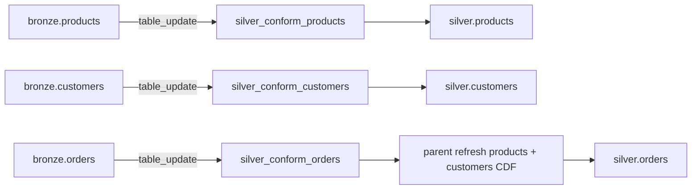

# Silver Per-Entity Orchestration — Design (v2)

**Status:** Approved — supersedes §10 of `2026-08-25-silver-layer-design.md`  
**Date:** 2026-08-25  
**Scope:** Silver job orchestration, triggers, RI without monolithic `conform_all`

---

## 1. Problem (why v1 failed)

The v1 design used one job (`de_assessment_silver_conform_all`) with `table_update` + `ANY_UPDATED` on three bronze tables and a single `conform_all.py` loop (`products → customers → orders`).

| Issue | Impact |
|-------|--------|
| Each bronze ingest fires the **full** silver pipeline | Up to 3 redundant job runs per data wave; wasted CE compute |
| One entity error aborts the loop | Products DQ/config failure blocked all silver |
| Misleading job success | Spark stream errors vs Python `break` / log mismatch |
| Name `conform_all` | Confusing — production path is not a manual “ingest all” |

Assessment PDF aligns with **three independent bronze sources** (customer DB, order system, product catalog) and separate ingest scripts — not one bundled orchestrator as the primary path.

---

## 2. Assessment alignment

| PDF / architecture signal | Design response |
|---------------------------|-----------------|
| Separate bronze ingests per source | Separate silver conform jobs per entity |
| Products weekly, customers daily, orders file-arrival | Per-table `table_update` triggers (one table per job) |
| RI on `orders` FKs | Orders job refreshes parent silver **before** FK checks |
| ~80 intentional orphan orders | Valid orders quarantine when FK missing; not “skip orders job” |
| Dimensions load independently (architecture §9) | Products/customers jobs do not gate each other |
| Four DQ categories + metrics | Unchanged — shared `silver/` library |

**Not optimized for:** batched “all three land together” as the primary prod pattern. Data-gen/E2E still works because orders job parent-refresh catches pending parent CDF.

---

## 3. Architecture

**Shared library:** `databricks/jobs/silver/src/silver/` — CDF, conform, DQ, quarantine, metrics, manifest (no change to medallion boundaries).

**Production entrypoints:**

| Job name | Python entry | Trigger |
|----------|--------------|---------|
| `de_assessment_silver_products` | `conform_products.py` | `table_update` on `{catalog}.bronze.products` |
| `de_assessment_silver_customers` | `conform_customers.py` | `table_update` on `{catalog}.bronze.customers` |
| `de_assessment_silver_orders` | `conform_orders.py` | `table_update` on `{catalog}.bronze.orders` |

Each job: `max_concurrent_runs: 1`, task `max_retries: 0`, serverless env client 4.

**Removed from production:** `de_assessment_silver_conform_all` / `conform_all.py` as triggered job. Keep `conform_all.py` + `run_conform_all()` for **manual full replay / debug only** (documented, not registered in CE lean registry).

---

## 4. Orders job — parent refresh (RI without monolith)

`conform_orders.py` calls `run_orders_conform_with_parent_refresh()`:

1. `parent_run_id = new_run_id()` (shared across parent refresh + orders for manifest correlation).
2. For each parent in `("products", "customers")`:
   - Run `run_entity_conform(spark, entity, ...)` — same CDF checkpoint path as standalone job.
   - On failure: log + manifest `failed` for that entity, **continue** (do not abort orders).
3. Run `run_entity_conform(spark, "orders", ...)` — **raises** on failure (job fails).

Parent refresh is cheap when no pending CDF: empty batch, zero manifest counts, checkpoint unchanged.

**RI semantics:** FK checks join `silver.customers` / `silver.products` at orders conform time. Parent refresh ensures bronze→silver lag is drained before FK evaluation. Intentional orphan FKs (~80 rows) still quarantine per assessment.

---

## 5. Failure isolation

| Failure | Products job | Customers job | Orders job |
|---------|--------------|---------------|------------|
| Products conform fails | Job **FAILED** | Independent | Parent refresh logs failure; orders still runs |
| Customers conform fails | Independent | Job **FAILED** | Parent refresh logs failure; orders still runs |
| Orders conform fails | Independent | Independent | Job **FAILED** |

No entity failure blocks another entity’s **scheduled/triggered** job. Orders may quarantine more rows if parents are stale — operational signal, not pipeline deadlock.

---

## 6. Idempotency and triggers

- **Per-entity CDF checkpoints** under `/Volumes/{catalog}/ops/checkpoints/silver/{entity}/`.
- **Delta MERGE** on entity PK — re-processing does not duplicate valid rows.
- **One bronze table update → one silver job** (single-table trigger; no `ANY_UPDATED` across three tables).
- Optional debounce on orders file-arrival path: `min_time_between_triggers_seconds: 60` on orders silver job only (matches bronze orders pattern).

Manifest rows (`layer=silver`) append per entity run; multiple runs per wave are expected and auditable.

---

## 7. Bundle and CE deploy

**Files:**

- `databricks/bundle/resources/silver.job.yml` — replace `job_silver_conform_all` with three jobs above; triggers **PAUSED** in bundle (CE E2E unpauses via registry).
- `scripts/ce_job_registry.py` — register three conform jobs; **delete/update** away `de_assessment_silver_conform_all` (upsert: rename = new job_id; prefer **update** existing conform_all job to orders-only OR create three new + leave old job PAUSED manual-only — **chosen:** three new jobs, remove conform_all from registry, PAUSE or delete conform_all on CE manually once).

**CE migration:** Deploy upserts three jobs. Existing `de_assessment_silver_conform_all` job_id can be **updated** to orders-only settings (preserves run history) OR left paused — **chosen:** update same job_id to orders conform + add two new jobs for products/customers to avoid orphan paused job.

| Existing CE job | Action |
|-----------------|--------|
| `de_assessment_silver_conform_all` (394033209538051) | **Update** → `de_assessment_silver_conform_orders`, single-table trigger on `bronze.orders` |
| — | **Create** `de_assessment_silver_conform_products`, `de_assessment_silver_conform_customers` |

---

## 8. E2E orchestrator (`medallion_e2e.py`)

- After each bronze ingest, wait for matching **entity** silver job (not conform_all).
- After orders bronze ingest, wait for `de_assessment_silver_conform_orders`.
- SQL verify unchanged: bronze batch rows, silver `_bronze_batch_id`, quarantine, `dq_metrics`, manifest `layer=silver`.

---

## 9. Testing

| Tier | Coverage |
|------|----------|
| unit | `run_orders_conform_with_parent_refresh` — parent failure does not raise; orders still invoked |
| spark | Parent refresh + orders FK with staged bronze CDF fixtures |
| cluster | Deploy three jobs; individual bronze ingests; one silver run per ingest; quarantine counts |

---

## 10. Non-goals

- Gold/dashboard changes
- Bronze ingest changes
- Replacing CDF/checkpoint model
- `ALL_UPDATED` single-wave trigger (wrong for weekly/daily/event bronze)

---

## 11. Success criteria

- [ ] Three silver conform jobs deployed; `conform_all` not in CE production registry
- [ ] One bronze table update → one silver job run (observed in CE)
- [ ] Products/customers failures do not prevent orders job execution
- [ ] Orders FK checks run after parent CDF drain; intentional orphans in quarantine
- [ ] Medallion E2E `passed: true` with individual bronze ingests
- [ ] `docs/superpowers/specs/2026-08-25-silver-layer-design.md` §10 annotated “superseded by this doc”
